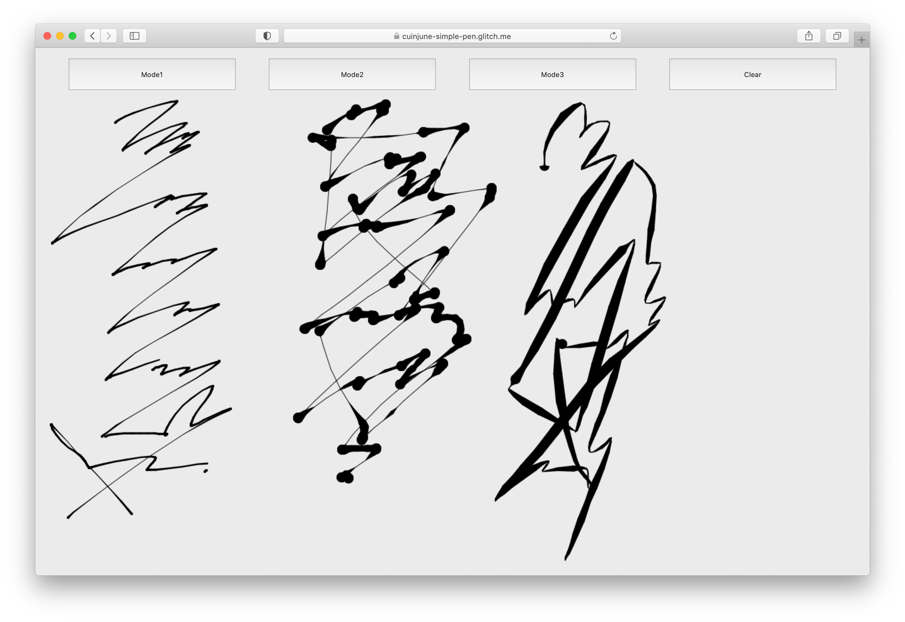

# simple-pen



This repo is the week6 assignment of the "Hand Held: Creative Tools for Phones" course at ITP.

Here's the [Live Demo on Glitch](https://cuinjune-simple-pen.glitch.me/).


I tried to use [Catmull-Rom splines](https://en.wikipedia.org/wiki/Centripetal_Catmull%E2%80%93Rom_spline) with the varying thicknesses but it didn't work as expected so I got rid of it.

```
function curveTo(to, curveResolution) {
    curveVertices.push(to);

    if (curveVertices.length == 4) {

      const x0 = curveVertices[0].x;
      const y0 = curveVertices[0].y;
      const r0 = curveVertices[0].r;
      const x1 = curveVertices[1].x;
      const y1 = curveVertices[1].y;
      const r1 = curveVertices[1].r;
      const x2 = curveVertices[2].x;
      const y2 = curveVertices[2].y;
      const r2 = curveVertices[2].r;
      const x3 = curveVertices[3].x;
      const y3 = curveVertices[3].y;
      const r3 = curveVertices[3].r;

      const startRad = r1;
      const endRad = r2;

      let t, t2, t3;
      let x, y, r;

      for (let i = 1; i <= curveResolution; i++) {
        t = i / curveResolution;
        t2 = t * t;
        t3 = t2 * t;

        x = 0.5 * ((2.0 * x1) +
          (-x0 + x2) * t +
          (2.0 * x0 - 5.0 * x1 + 4 * x2 - x3) * t2 +
          (-x0 + 3.0 * x1 - 3.0 * x2 + x3) * t3);

        y = 0.5 * ((2.0 * y1) +
          (-y0 + y2) * t +
          (2.0 * y0 - 5.0 * y1 + 4 * y2 - y3) * t2 +
          (-y0 + 3.0 * y1 - 3.0 * y2 + y3) * t3);

        r = startRad + (endRad - startRad) * t; // lerp
        points.push({ x: x, y: y, r: r });
      }
      curveVertices.shift();
    }
  }

 ```
